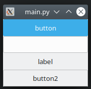

# zz
zz is a PyGObject wrapper created to simplify the Glade/Python development.

The idea is to encapsulate the Gtk libraries to in an near future be possible to maybe replace with some other implementations.

## Example 

### Implementation:

> Same as [main.py](main.py)

```python
from zz import zApp, zWindow, zWidget


class MainWindow(zWindow):
    def __init__(self):
        # the glade file and window name
        super().__init__("main", "window1")

    # this method is called after window build
    def __build__(self):
        # assigning an event, accessing the widget directly on "self"
        self.txt.on_changed.add(self.on_txt_changed)

    # this event is assigned on .glade file
    def btn_clicked(self, wid: zWidget):
        # accessing gtk widgets properties as properties
        wid.label = self.lbl.text
        self.lbl.text = self.txt.text

    def on_txt_changed(self, wid: zWidget):
        print(wid.text)


if __name__ == '__main__':
    app = zApp()
    app.run(MainWindow())
```

### Screenshot


## Dependencies

- **python-gi** - `sudo apt install python-gi`

## TODO

- Better exit event handling (keyboard interrupt, etc)
- Tests with complex windows
